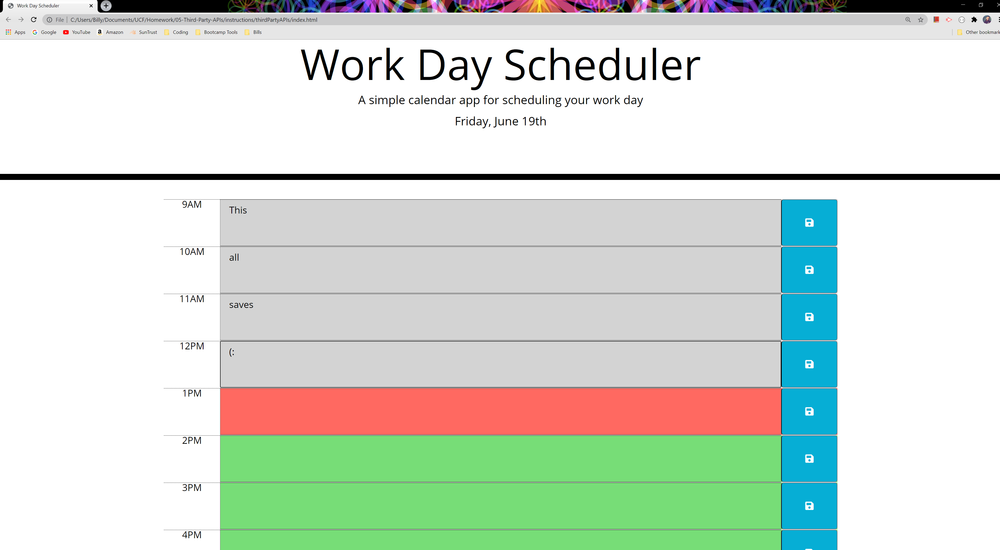

# thirdPartyAPIs - Day Planner
This is a planner where you can plan your work day per hour and save them to your local storage. We were referenced to moment.js to implement real time into our planner.

moment.js is a third party API and this was our first assignment linking in an API and using such tool.

The program really wasn't code heavy at all, and there really wasn't much JavaScript behind it. Although, the JavaScript behind this assignment was still pretty logic heavy and it took a few hours to work around some bugs. 

## Inside this Planner:
Once inside, you'll notice at the top that what I have built is a Work Day Scheduler. Typically, that consists of the hours between nine and five. If the time listed on the planner is before your current time, you'll see grey. The time block that represents your current time will show red. Any time in the future will then proceed to be green. You have the date displayed under the title, before the time blocks. Any text you input will be saved to your local storage divice by clicking the blue box with the save icon on the left hand side. The text you input will remain there until you clear out your storage inside the console log, or if you delete the contents and hit save once again. 

### Here's what the planner looks like:

Link to the planner: https://wleondike.github.io/thirdPartyAPIs/

